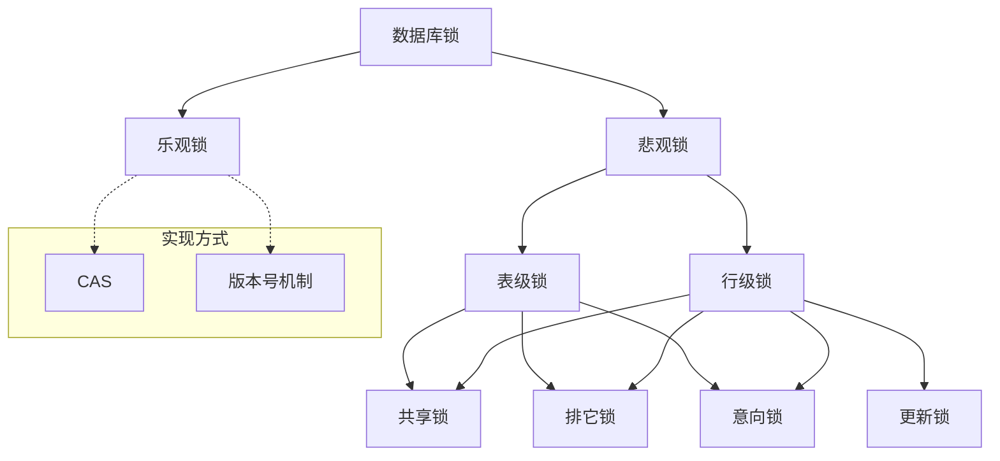

# 数据库原理

## 悲观锁和乐观锁[<sup>1</sup>][^1]

### 概念

乐观锁和悲观锁是两种思想，用于解决并发场景下的数据竞争问题，它们的使用是非常广泛的，**不局限于某种编程语言或数据库**。

* 乐观锁
  
  乐观锁在操作数据时非常乐观，认为别人不会同时修改数据。因此乐观锁不会上锁，只是在执行更新的时候判断一下在此期间别人是否修改了数据：如果别人修改了数据则放弃操作，否则执行操作

* 悲观锁
  
  悲观锁在操作数据时比较悲观，认为别人会同时修改数据。因此操作数据时直接把数据锁住，直到操作完成后才会释放锁；上锁期间其他人不能修改数据。

### 实现方式

悲观锁的实现方式是加锁，加锁既可以是对代码块加锁（如 Java 的 `synchronized` 关键字），也可以是对数据加锁（如 MySQL 中的排它锁）。

乐观锁的实现方式主要有两种：CAS 机制和版本号机制

#### CAS（Compare And Swap）

CAS操作包括了3个操作数：

* 需要读写的内存位置(`V`)
* 进行比较的预期值(`A`)
* 拟写入的新值(`B`)

CAS 操作逻辑如下：如果内存位置 `V` 的值等于预期的 `A` 值，则将该位置更新为新值 `B`，否则不进行任何操作。许多 CAS 的操作是自旋的：如果操作不成功，会一直重试，直到操作成功为止。

> :sparkles: CAS 是由 CPU 支持的原子操作，其原子性是在硬件层面进行保证的。

##### 缺点

1. ABA 问题
2. 忙等问题
3. 功能受限
4. 灵活度

#### 版本号机制

版本号机制的基本思路是在数据中增加一个字段 `version`，表示该数据的版本号，每当数据被修改，版本号加 `1`。当某个线程查询数据时，将该数据的版本号一起查出来；当该线程更新数据时，判断当前版本号与之前读取的版本号是否一致，如果一致才进行操作。

需要注意的是，这里使用了版本号作为判断数据变化的标记，实际上可以根据实际情况选用其他能够标记数据版本的字段，如时间戳等。

例：

```sql
select coins, level, version from player where player_id = {0} # 先查出所需要的信息和版本
# ... 根据查出信息进行一系列操作
update player set coins = {0}, version = version + 1 where player_id = {1} and version = {2} # 更新时以版本作为条件之一
```

#### 适用场景

1. 功能限制

    乐观锁相较于悲观锁会有更多的限制

    例如，CAS 只能保证单个变量操作的原子性，当涉及到多个变量时，CAS 是无能为力的，而 `synchronized` 则可以通过对整个代码块加锁来处理。再比如版本号机制，如果 query 的时候是针对*表 1*，而 update 的时候是针对*表 2*，也很难通过简单的版本号来实现乐观锁。

2. 竞争激烈程度

    在悲观锁和乐观锁都可用时，考虑竞争激烈程度

    * 当竞争不激烈 (出现并发冲突的概率小)时，乐观锁更有优势，因为悲观锁会锁住代码块或数据，其他线程无法同时访问，影响并发，而且加锁和释放锁都需要消耗额外的资源。
    * 当竞争激烈(出现并发冲突的概率大)时，悲观锁更有优势，因为乐观锁在执行更新时频繁失败，需要不断重试，浪费 CPU 资源。

## 数据库锁



一般所谈论的数据库锁都是悲观锁

* 共享锁：又称读锁或 S 锁，加了该锁后还可以加共享锁或更新锁，并发性好
* 独占锁：又称写锁或 X 锁，只允许一个事务访问锁定的数据，其它访问需等待
* 更新锁：跟共享锁类似，但只能加一个，用于更新前读取，会升级为独占锁，用于解决多个共享锁同时要升级为独占锁时可能导致的死锁问题
* 意向锁：在加行锁前需要对表加的锁，用来保证表锁的正常高效运作，根据操作的不同，又分为意向共享锁和意向独占锁

## 事务

### 特性

* **A(Atomic，原子性)** —— 将所有 SQL 作为原子工作单元执行，要么全部执行，要么全部不执行；
* **C(Consistent，一致性)** —— 事务完成后，所有数据的状态都是一致的；
* **I(Isolation，隔离性)** —— 如果有多个事务并发执行，每个事务作出的修改必须与其他事务隔离；
* **D(Duration，持久性)** —— 即事务完成后，对数据库数据的修改被持久化存储。

### 隔离级别

#### 并发访问导致的数据读取问题

* **第一类丢失更新**：两个事务同时更改一个数据，其中一个事务提交后，另一个事务回滚，先提交的数据丢失（标准定义的所有隔离界别都不允许）  
* **第二类丢失更新**：两个事务同时更改一个数据，其中一个事务先提交，另一个事务后提交，先提交的数据被覆盖
* **脏读**，指一个事务中访问到了另外一个事务未提交的数据
* **不可重复读**，在一个事务中多次读取，数据前后出现不一致
* **幻读**，在一个事务中读取到了事务进行过程中，插入的新数据

> 不可重复读重点在于 update 和 delete，而幻读的重点在于 insert。
>
> 在可重复读中，该 SQL 第一次读取到数据后，就将这些数据加锁，其它事务无法修改这些数据，就可以实现可重复读了。但这种方法却无法锁住 insert 的数据，所以当事务 A 先前读取了数据，或者修改了全部数据，事务 B 还是可以 insert 数据提交，这时事务A就会发现莫名其妙多了一条之前没有的数据，这就是幻读，不能通过行锁来避免。需要 Serializable 隔离级别 ，读用读锁，写用写锁，读锁和写锁互斥，这么做可以有效的避免幻读、不可重复读、脏读等问题，但会极大的降低数据库的并发能力。

#### 四种隔离级别

| 隔离级别                     | 脏读（Dirty Read） | 不可重复读（NonRepeatable Read） | 幻读（Phantom Read） |
| :--------------------------- | :----------------- | :------------------------------- | :------------------- |
| 未提交读（Read uncommitted） | 可能               | 可能                             | 可能                 |
| 已提交读（Read committed）   | 不可能             | 可能                             | 可能                 |
| 可重复读（Repeatable read）  | 不可能             | 不可能                           | 可能                 |
| 可串行化（Serializable ）    | 不可能             | 不可能                           | 不可能               |

* 未提交读(Read Uncommitted)：允许脏读，也就是可能读取到其他会话中未提交事务修改的数据
* 提交读(Read Committed)：只能读取到已经提交的数据，Oracle 等多数数据库默认都是该级别
* 可重复读(Repeated Read)：同一事务内的前后查询都保持一致，InnoDB 默认级别
* 串行读(Serializable)：完全串行化的读，每次读都需要获得表级共享锁，读写相互都会阻塞

[^1]: https://www.cnblogs.com/kismetv/p/10787228.html "这部分笔记内容整理自博客园【BAT面试题系列】面试官：你了解乐观锁和悲观锁吗？"